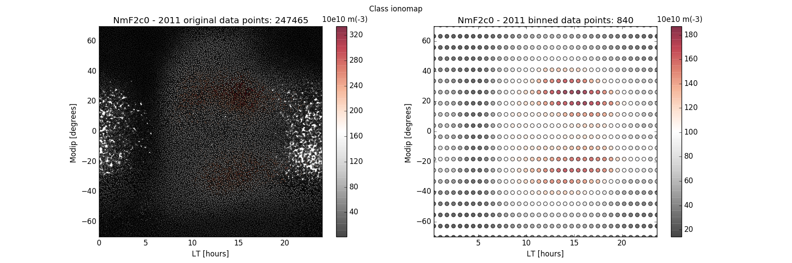
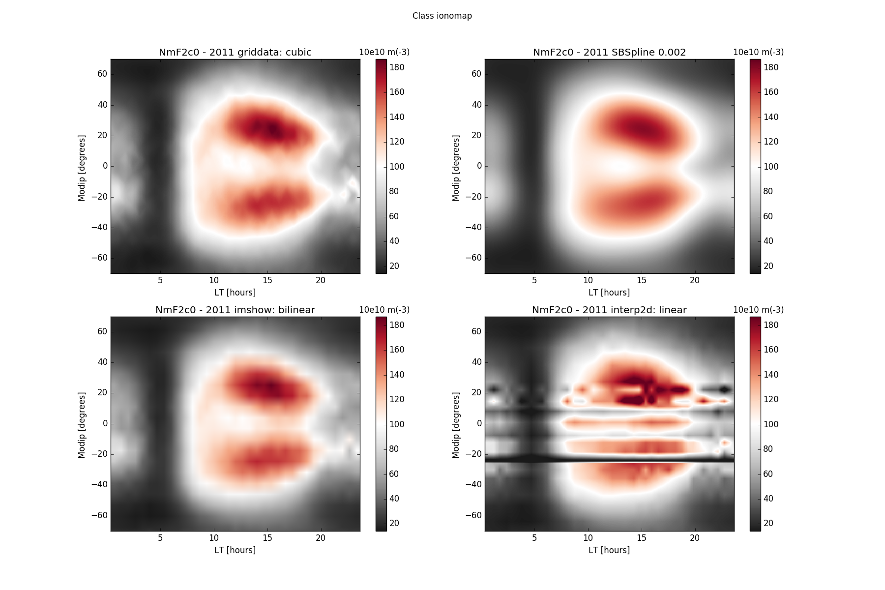
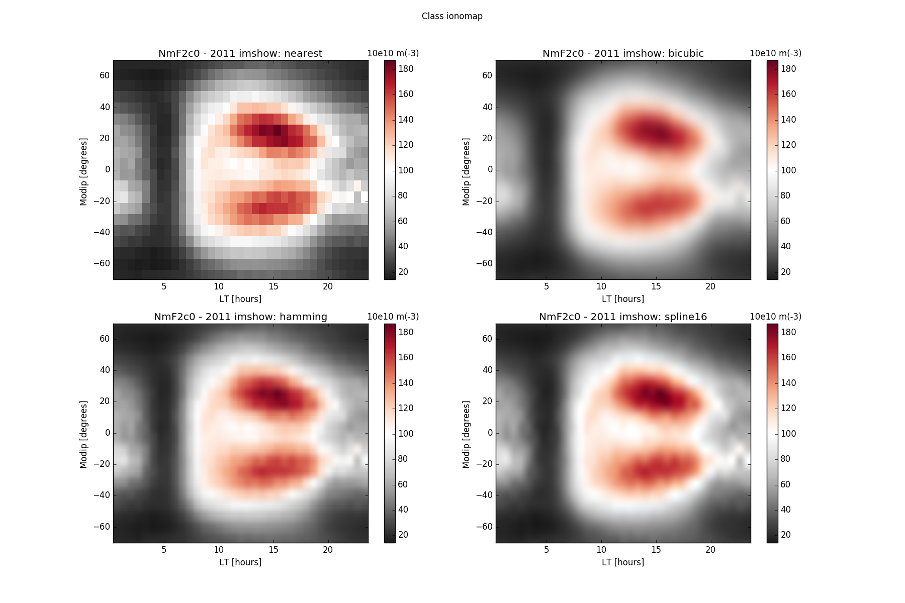
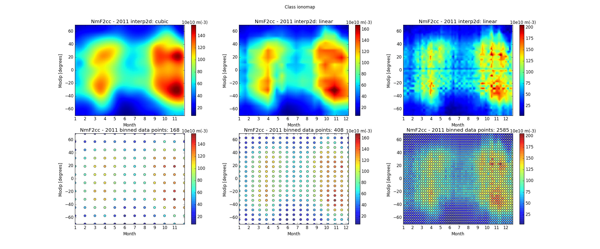

# Proyecto IONOS*
[*]Realizado por Ayelen E. Volk, estudiante de doctorado FCAG - UNLP

## Introduccion

Este directorio contiene un programa presentado como trabajo final para el curso de postagrado Herramientas computacionales para Cienticificos (HCC) dictado 2016, del Insitituto de Fisica de Líquidos y Sistemas Biológicos.

El código esta esctrito en Phython 2.7 y utilicé el paradigma de Programación Orientada a Objetos (POO). La documentación del código fue realizada con un estilo que permite generarla en forma automatica usando [Doxygen](http://www.stack.nl/~dimitri/doxygen/index.html). Destaco que es la primera vez que utilizo estas herramientas para desarrollar una tarea vinculada a mi trabajo de investigación y explorarlas fue un gran aprendizaje. Presento aqui el inicio de un trabajo que se extenderá más alla de este curso. 

Lo primero que hice fue familiarizarme y explorar Python, armando el código como estaba acostumbrada a programar, osea, de forma modular (estructurada). Finalmente, reescribí el programa a la forma de POO. Fue muy grafificante ver que, de esta última forma, la lectura del programa se simplificaba y ordenaba mucho mejor respecto a la anterior. Resultando más sencillo incorporar modificaciones y/o nuevas funciones. El programa principal ganó mucha flexibilidad. Mi conclusión luego de este trabajo es que si bien POO requirió un esfuerzo adicional (y bastante tiempo!), las ventajas (y satisfacciones) hicieron que valiera la pena. A futuro, espero afianzar esta forma de programar.


## ¿Que hace el programa?

El programa básicamente en un graficador ajustado a las necesidades del modelado de la ionósfera terrestre. Es capaz de mapear diferentes parámetros ionoféricos de la capa F2 y mostrar su variabilidad espacial en mapas de modip (latitud geomagnética) vs Local Time (relacionado con la longitud geofragica). También, la variabilidad temporal o estacional: modip vs DOY (Doy of Year). Aunque estos son los mapas realizados en este trabajo, el programa soporta cualquiera elección (x,y) del usuario.

Para mapear cada parametro, aproximadamente 250.000 valores por año, construí la Clase Ionomap que tiene 5 métodos diferentes de suavizado, interpolación y visualización de datos; basados en la utilización de los paquetes `Scipy.interpolate` y `matplotlib.pylab`. 

Los conjuntos de datos a plotear se obtienen del LPIM, La Plata ionospheric Model, modelo que estudio en el marco de mi doctorado. El LPIM tiene la capacidad de calcular dichos parámetros empleando observaciones satelitales (misión FORMOSAT-COSMIC) o coeficientes recomendados por la ITU-R, International Telecommunication Union Radiocommunication Sector, entre otras cosas. El programa puede leer las salidas del LPIM y extraer la información del parametro solicitado por el main(). Para eso, crea objeto de Clase Ionodat. Los objetos instancia Ionodat tienen las carterísticas específicas de la data obtenida a partir del LPIM database.


## El código

El paquete que se necesita para correr el programa esta compuesto por los siguientes módulos:

`main.py` :  posee la funcion main() y es el que debe ejecutarse.

`ionodat.py` : contiene la Clase Ionodat y todos sus atributos.

`ionomap.py` : contiene la Clase Ionomap y todos sus atributos.

`takefiles.py` : contiene funciones empleadas por la clase Ionodat.

La documentación de los modulos y clases esta en el directorio `Doc`, en formato [html](Doc/html/index.html).

Nota: Es necesario tener la base de datos del LPIM para correr el programa. Sin embargo, hago esta entrega con una version de prueba y un pequeño set de datos. Los detalles estan al final de documento.

A continuación, listo las librerias de Python que empleé para desarrollar el trabajo:
* numpy 
* sys
* os
* matplotlib.pyplot
* scipy.stats 
* scipy.interpolate
* glob
* time
* datetime
* calendar


## Resultados

La versión del programa que he presentado procede así:

1_Crea un objeto instancia de clase Ionodat para el parametro 'NmF2'.

2_Para rango de fechas solicitado (en seste caso año 2011 completo) extrae set de datos relacionados con ese parametro de los archivos tipo 'prm', previo chequeo de disponibilidad en el LPIM databse.

3_Crea objeto instancia Ionomap para graficar parametro 'NmF2c0' sobre plano [LT,modip]. c0, es la notación para indicar que el parametro fue calculado por el LPIM en modo autónomo, es decir, usando coeficientes de ITU-R). 
A partir de esta instancia crea 3 figuras, cada una con varios subplots.  
[La primera](Image/NmF2c0_2011_LT_verdata.png), muestra  un subplot de los datos y otro de los datos suavizados, tomando un estadistico sobre unidad de area (bin) del tamaño especificado por usuario.



[La Segunda](Image/NmF2c0_2011_LT_metodos.png), los subplots muestran los distintos métodos de la instancia, aplicados a la data suavizada.



[La tercera](Image/NmF2c0_2011_LT_imcompare.png), los subplots son realizados con el mismo método, 'imshow', pero empleando diferentes órdenes de interpolación.

 

4_Finalemte, crea otra instancia Ionomap para parámetro 'NmF2cc' sobre el plano [DOY,modip]. 'cc' es la notación para indicar que el parámetro fue calculado por el LPIM en modo asimilación de datos.

A partir de esta instancia, crea una [figura](Image/NmF2cc_2011_Mo_int2dcompare.png) con varios subplots. En primera fila, estan los realizados con el mismo método, 'interp2d', pero aplicado a data con diferente binnedado. La data promediada se muestra debajo correspondientemente.



## Test

Los gráficos obtenidos corresponden al procesamiento de un año entero de datos.  Tal cantidad de datos permite alcanzar buena cobertura del plano (x,y), por ende, buenos resultados aplicando la mayoría de los métodos de interpolacion. Reducir la cantidad de datos empleada, empobrece la calidad de los mapas generados.

El subdirectorio `test` contiene una version del programa que puede ejecutarse para un pequeño set de datos (3 meses completos del año 2011), que estan en la carpeta LPIMdata. Esta versión puede usarse como tester de las clases construidas.

El script que se debe ejecutar es `test.py`.


```python

```
